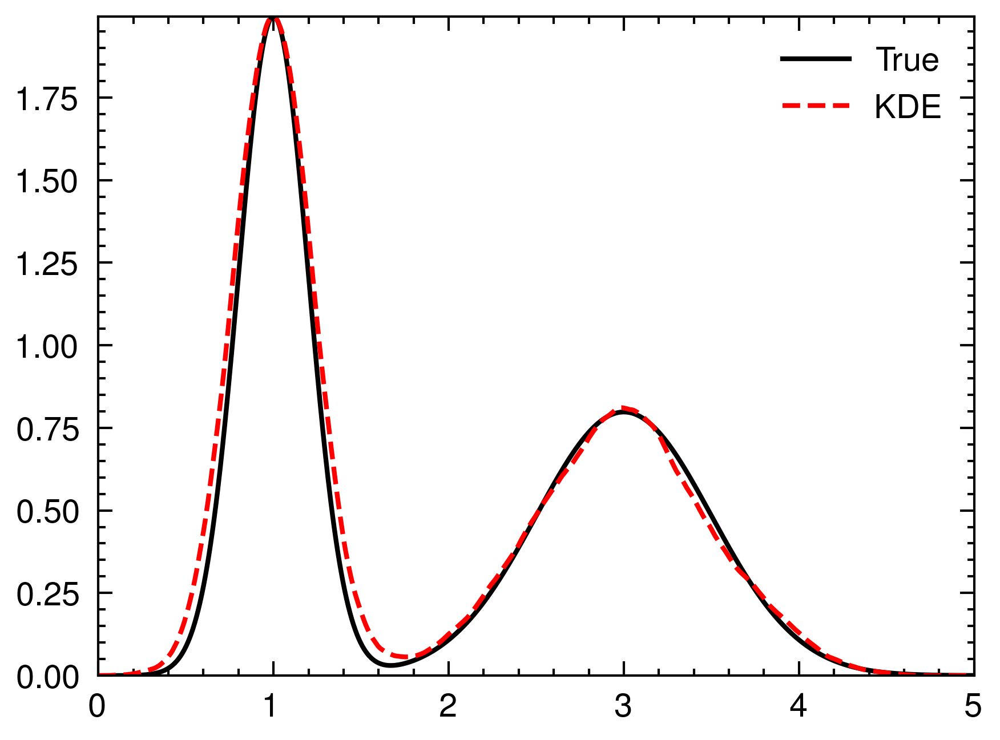

# KDE from Scratch

This is a simple project that demonstrates Kernel Density Estimation (KDE) from scratch using Rust. KDE is a non-parametric way to estimate the probability density function of a random variable.

## Description

The project generates a mixture of two normal distributions and uses different kernel functions (Epanechnikov, Gaussian, Tricube, and Quartic) to estimate the underlying density function.
It then compares the estimated density with the true density function and generates a histogram of the samples.


## Dependencies

This project uses the following dependencies:

- `peroxide`: For random number generation, cubic hermite spline, piecewise rejection sampling and plotting.
- `rayon`: For parallel computation.

## Usage

To run the project, simply compile and execute the `main.rs` file:

```
cargo run
```

This will generate the `kde.png` and `histogram.png` files in the project directory.

## Results

1. `kde.png`: A plot showing the true density function and the estimated density function using KDE.
   
2. `histogram.png`: A plot showing the true density function and a histogram generated using the samples obtained from the estimated density function.
   

## Contributing

Contributions are welcome! If you find any issues or have suggestions for improvements, please open an issue or submit a pull request.

## License

This project is licensed under the [MIT License](LICENSE).
